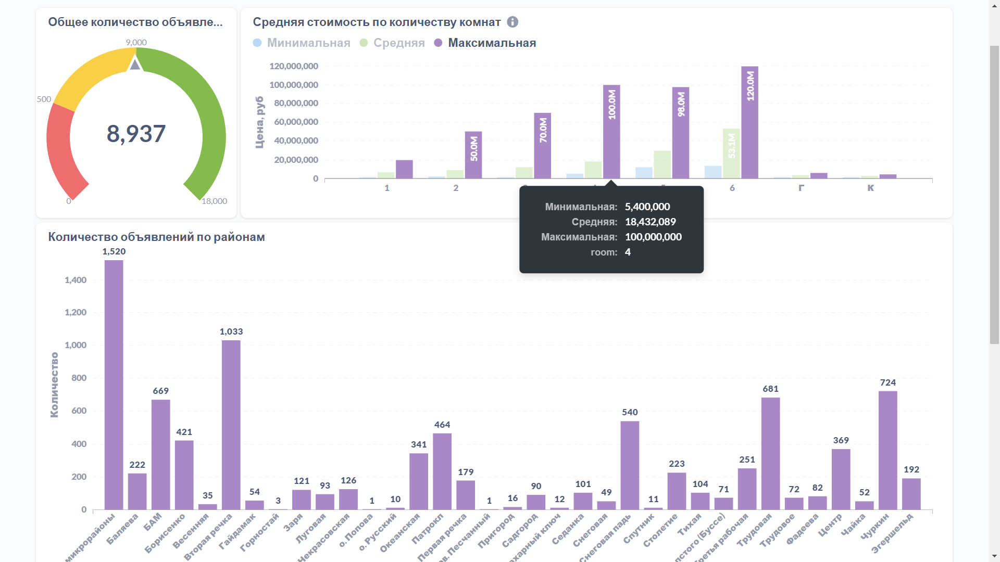
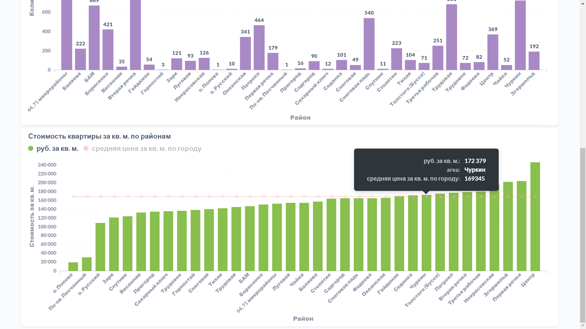

#Scrapy - сбор атрибутивной информации о недвижимости из открытых источников
##Проект создавался как ETL - процесс для дальнейшей аналитической обработки на BI платформе Metabase. 





### Как запустить проект:

Клонировать репозиторий и перейти в него в командной строке:

```
bash
https://github.com/taren4ik/Scrapy
cd Scrapy
```

Cоздать и активировать виртуальное окружение:

```
bash
python -m venv venv
```

Для *nix-систем:
```
bash
source venv/bin/activate
```

Для windows-систем:
```
bash
source venv/Scripts/activate
```

Установить зависимости из файла requirements.txt:

```
bash
python -m pip install --upgrade pip
pip install -r requirements.txt
```
Создать файл .env и указать переменные окружения:


Запустить проект:

```
bash
python selenium_version.py
```


***Над проектом работал:***
* Дмитрий Пермяков | Github:https://github.com/taren4ik
* Презентация Проекта на платформе Metabase farpost-analytics.site

